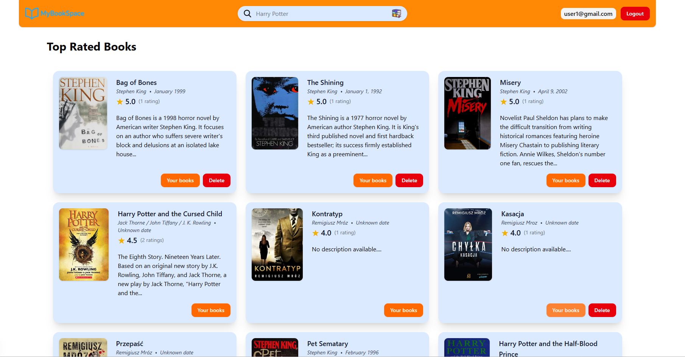
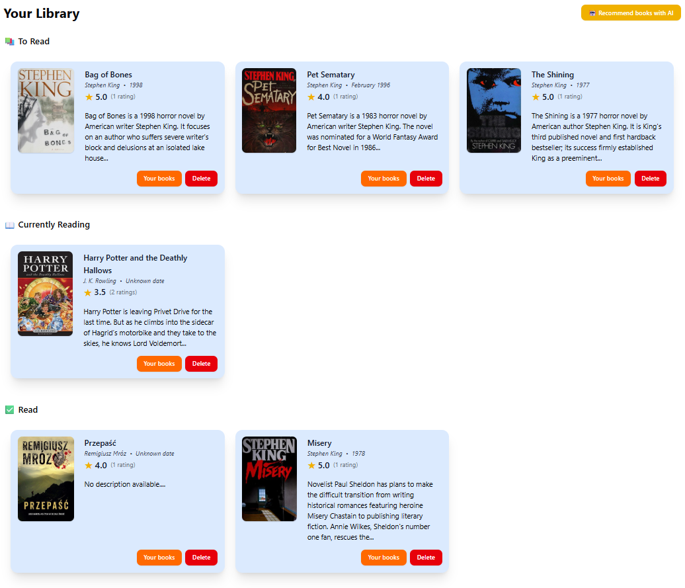
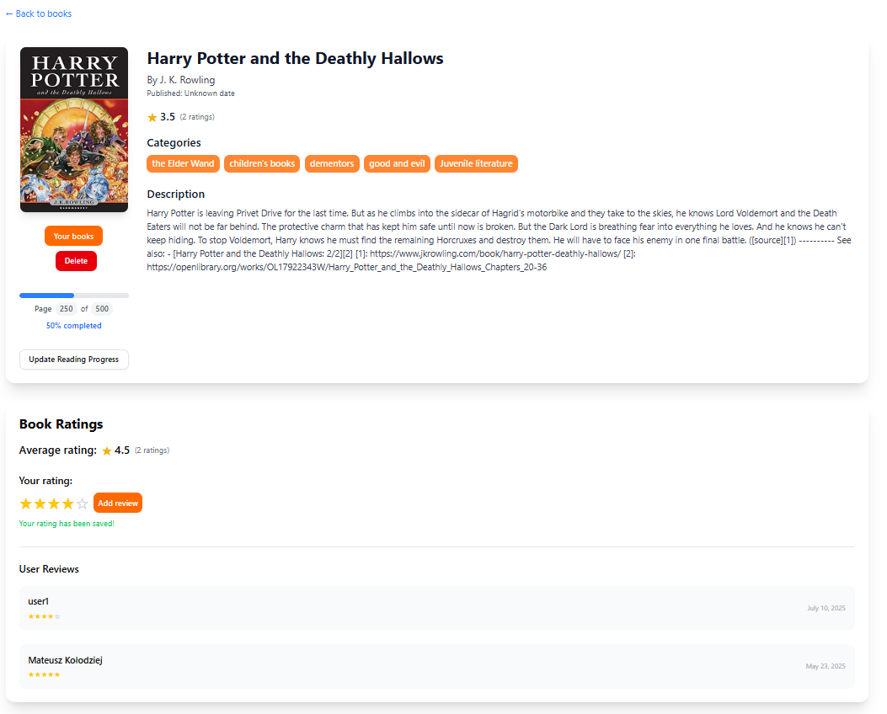
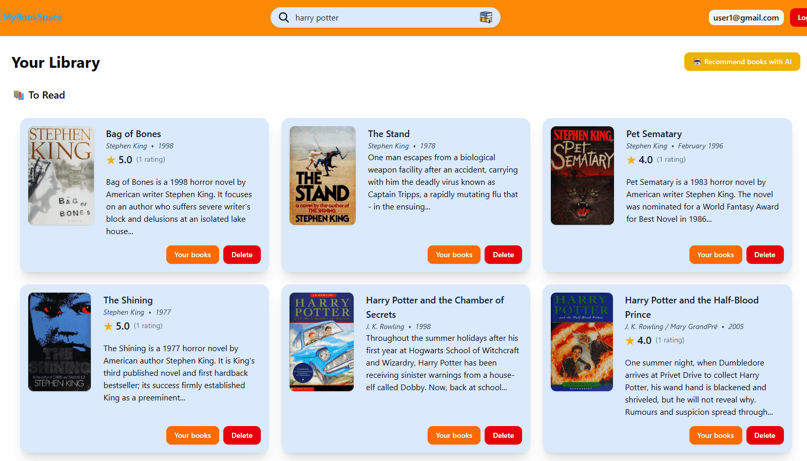
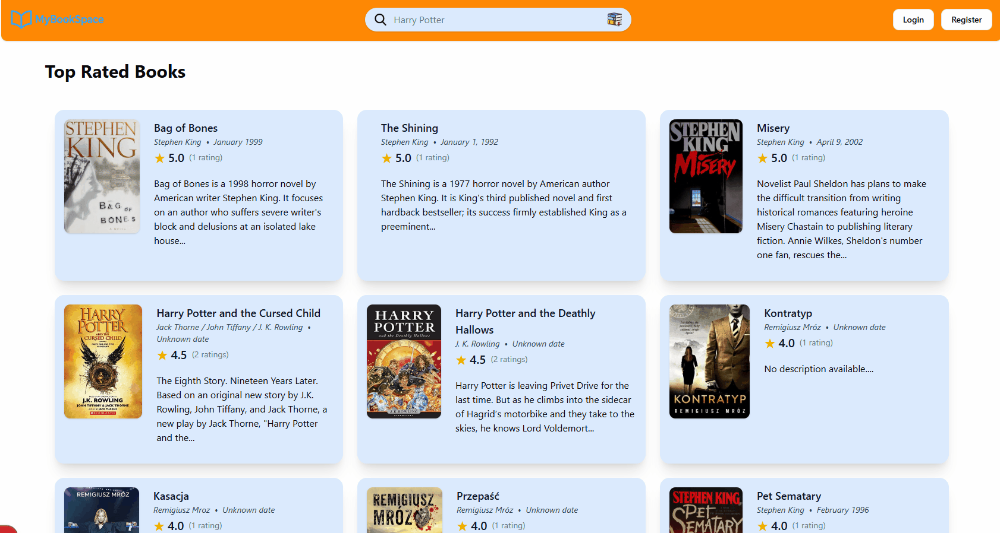
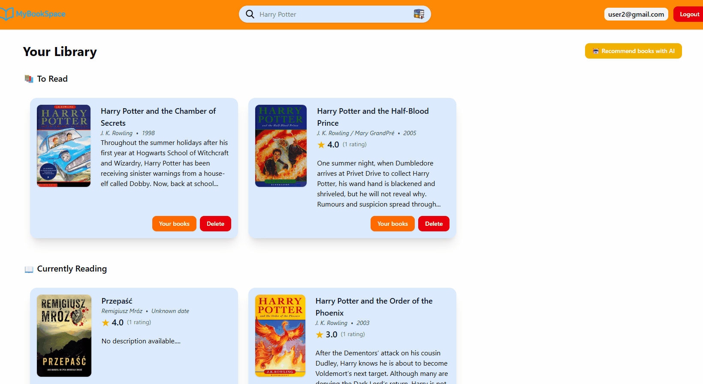
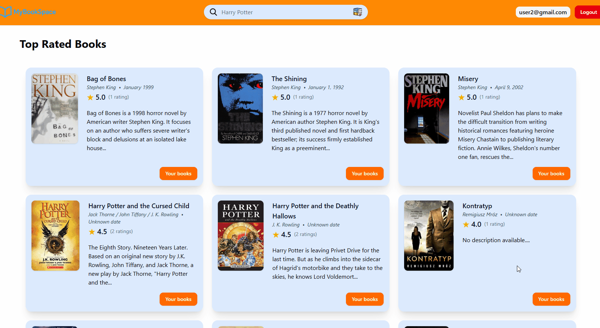

# 📚 MyStorySpace - Social Book Platform

> **Społecznościowa platforma dla miłośników książek** - miejsce gdzie czytelnicy mogą odkrywać nowe tytuły, dzielić się recenzjami i śledzić swoje postępy w czytaniu.

## 🎯 O Projekcie

MyStorySpace to kompleksowa aplikacja webowa stworzona z myślą o miłośnikach literatury. Łączy w sobie funkcjonalności katalogowania książek, systemu ocen i recenzji oraz śledzenia postępów w czytaniu.

### 🌟 Kluczowe funkcjonalności

- **📖 Katalog książek** - Wyszukiwanie i przeglądanie bogatej bazy książek
- **👤 Zarządzanie biblioteką** - Tworzenie list: "Czytam teraz", "Chcę przeczytać", "Przeczytane"
- **⭐ System ocen** - Ocenianie książek w skali 1-5 gwiazdek
- **📝 Recenzje** - Pisanie i czytanie opinii innych czytelników
- **📊 Śledzenie postępów** - Zapisywanie aktualnej strony i monitoring postępów
- **🤖 Rekomendacje AI** - Inteligentne sugestie książek na podstawie preferencji

## 📸 Zrzuty ekranu

### Strona główna



### Profil użytkownika



### Szczegółowa karta książki



### Rekomendacje AI



## 🛠️ Stack technologiczny

**Frontend:**

- **React** - Biblioteka do budowy interfejsu użytkownika
- **Next.js** - Framework React z renderowaniem po stronie serwera
- **TypeScript** - Typowanie statyczne dla większej niezawodności
- **Tailwind CSS** - Utility-first CSS framework
- **shadcn/ui** - Komponenty UI wysokiej jakości

**Backend:**

- **Firebase** - Backend-as-a-Service
  - Authentication (Email/Password, Google OAuth)
  - Firestore Database
  - Hosting
- **Next.js API Routes** - Serverless API endpoints

**External APIs:**

- **Open Library API** - Baza danych książek
- **Hugging Face** - Generowanie rekomendacji AI

## 🏗️ Architektura

Aplikacja wykorzystuje architekturę serverless z Next.js jako full-stack framework. Frontend komunikuje się z Firebase przez SDK, a zewnętrzne API są wywoływane przez Next.js API Routes.

```
Frontend (React/Next.js)
    ↓
Firebase (Auth + Firestore)
    ↓
Next.js API Routes
    ↓
External APIs (Open Library, Hugging Face)
```

## 📱 Główne funkcjonalności

### 🔐 Autentykacja

- Rejestracja i logowanie (email/hasło)
- Logowanie przez Google
- Resetowanie hasła
- Bezpieczne zarządzanie sesją



### 📚 Zarządzanie biblioteką

- **Czytam teraz** - Książki w trakcie czytania z możliwością zapisywania postępów
- **Chcę przeczytać** - Wishlist przyszłych lektur
- **Przeczytane** - Archiwum ukończonych książek z ocenami



### 🔍 Wyszukiwanie i odkrywanie

- Wyszukiwanie po tytule, autorze, ISBN
- Szczegółowe karty książek z opisami i okładkami
- Lista najpopularniejszych i najlepiej ocenianych książek



### ⭐ System ocen i recenzji

- Ocenianie książek w skali 1-5 gwiazdek
- Pisanie szczegółowych recenzji
- Wyświetlanie średnich ocen społeczności


### 🤖 Rekomendacje AI

- Personalizowane sugestie na podstawie przeczytanych książek
- Analiza preferencji czytelniczych
- Odkrywanie nowych autorów i gatunków


## 🔮 Przyszłe funkcjonalności

- **💰 Porównywarka cen** - Najlepsze oferty książek online
- **🏆 Wyzwania czytelnicze** - Gamifikacja czytania
- **📚 Biblioteki publiczne** - Integracja z systemami bibliotecznymi

## 🤝 Autor

**[Mateusz Kołodziej]**

- GitHub: [@kolodziejmateusz](https://github.com/kolodziejmateusz)

- Email: mateuszkolodziejti@gmail.com

⭐ **Jeśli podoba Ci się ten projekt, zostaw gwiazdkę!** ⭐
