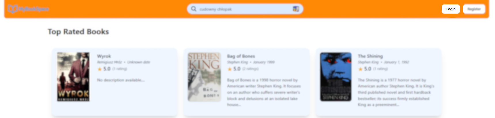
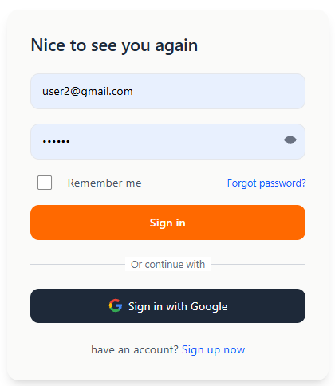

# Logowanie

1. Na stronie głównej kliknij **"Login"**.

<figure><figcaption></figcaption></figure>

2. Możesz zaznaczyć opcję **"Remember me"**, jeśli chcesz, aby system zapamiętał Twoje dane logowania.
3. Zaloguj się, używając adresu e-mail i hasła lub zaloguj się za pomocą konta Google.

<figure><figcaption></figcaption></figure>
