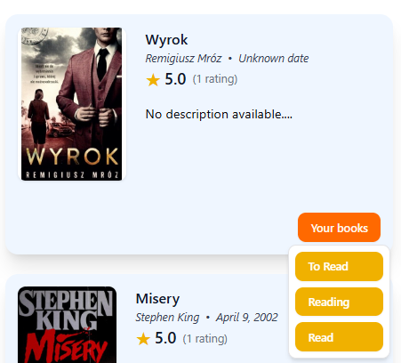
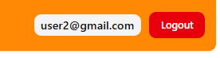
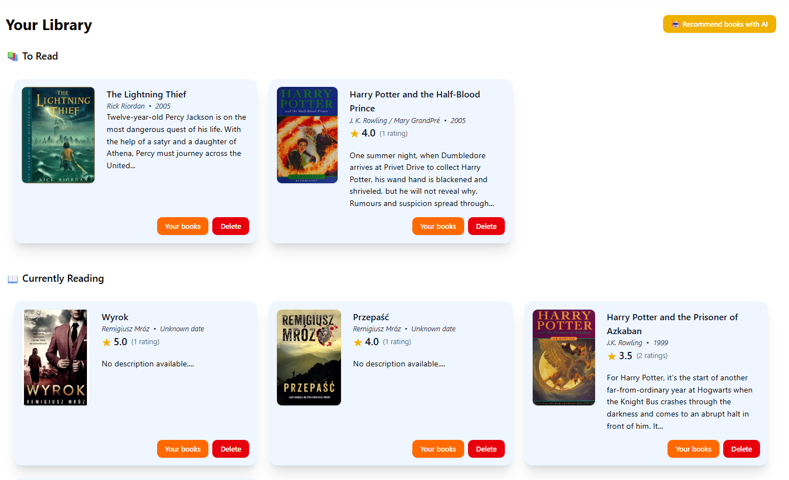
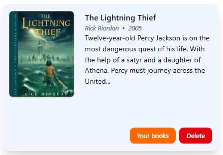
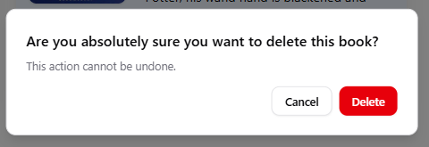

# Moja półka

## Dodawanie ksiązki

Ksiązke można dodać do jednej z trzech list/półek: To Read, Reading, Read

Aby dodać ksiązke do półki na karcie ksiązki lub na stronie szczegółowej ksiązki kloknij "Your books" i wybiez do jakiej listy chcesz dodać ksiązke

<figure><figcaption></figcaption></figure>

## Przeglądanie Półki

1. Aby się przejść to swoich ksiązek kliknij baner z swoim emailem

<figure><figcaption></figcaption></figure>

2. Teraz możesz zobaczyć wszystkie swoje ksiązki

<figure><figcaption></figcaption></figure>

## Usuwanie ksiązki

1. Aby usunąć ksiązke kliknij "Delete"

<figure><figcaption></figcaption></figure>

2. Potwierdz swój wybór klikajać jeszcze raz "Delete"

<figure><figcaption></figcaption></figure>

