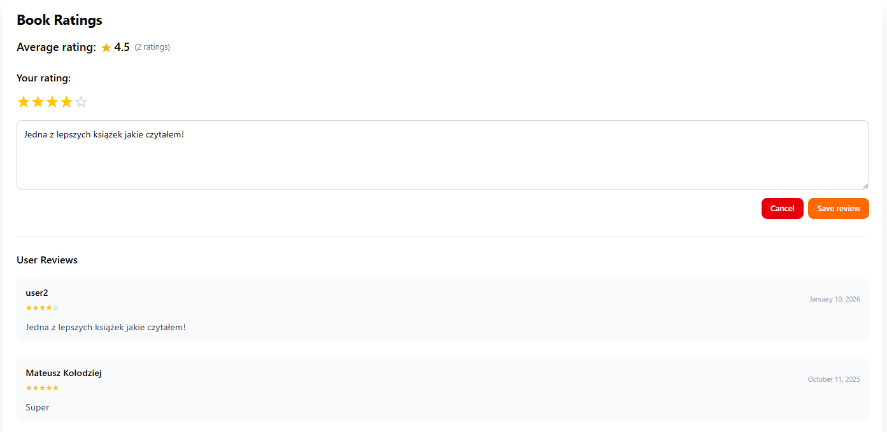

# Recezowanie ksiązki

Na karcie ksiązki oraz na widoku szczegółowym ksiązki możesz zobaczyć ocene ksiązki, ile ksiązka ma gwiazdek od 1 do 5 oraz jak wieli użytkowników oceniło ksiązke.

## Jak ocenić ksiązke?

1. Wejdz na szczegółowy widok ksiązki, zobaczysz sekcje "Book Ratings". Możesz tu zobaczyć liste recnzji.
2. Aby dodać własną recenzje, kliknij ilość gwiazdek jakie chcesz przyznać.
3. Teraz możesz dodać kometarz i kliknąc "Save review".

<figure><figcaption></figcaption></figure>
