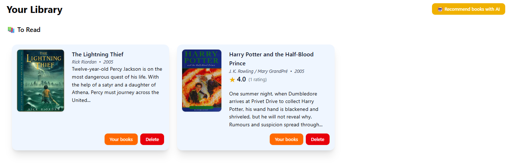
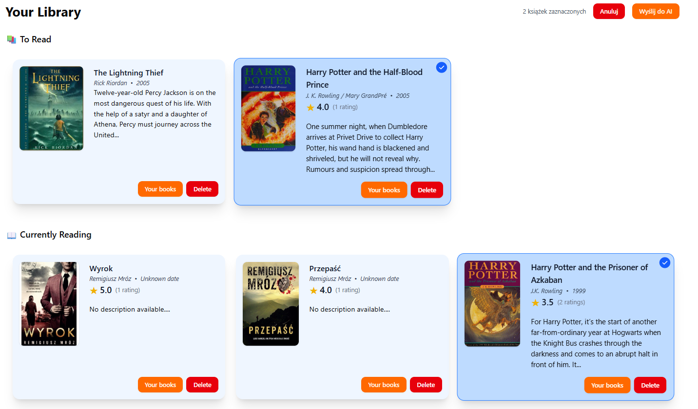
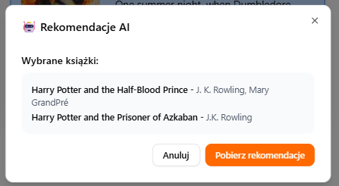
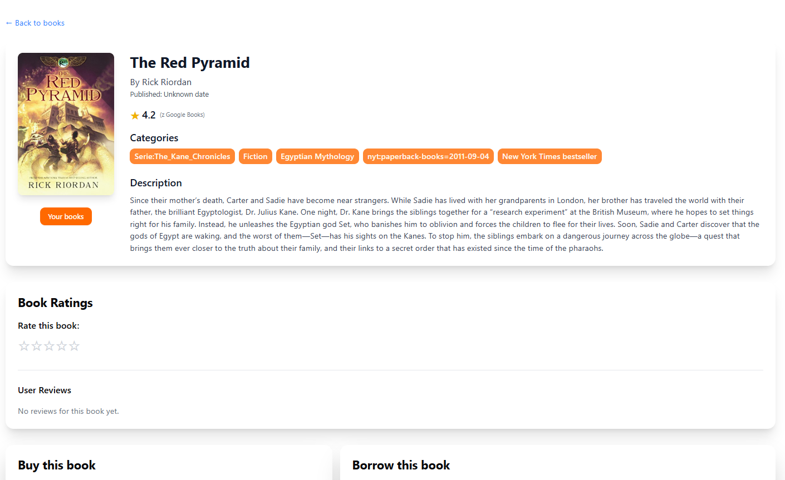

# Rekomendacje AI

Często nie wiemy, co przeczytać po zakończeniu dobrej książki. Z pomocą przychodzi nasza funkcja rekomendacji AI – na podstawie kilku wybranych tytułów otrzymasz inteligentne sugestie, co warto przeczytać dalej.

Aby skorzystać z funkcji polecania książek, postępuj zgodnie z poniższymi krokami:

1. Na swojej półce kliknij **"🤖 Recommend books with AI"**.

<figure><figcaption></figcaption></figure>

2. Wybierz książki, na podstawie których chcesz otrzymać rekomendacje.

<figure><figcaption></figcaption></figure>

3. Kliknij **"Wyślij do AI"**.
4. Po wyświetleniu podsumowania wybranych tytułów kliknij **"Pobierz rekomendacje"**.

<figure><figcaption></figcaption></figure>

5. Po chwili zobaczysz polecane książki. Możesz od razu dodać je do swojej listy lub przejść do szczegółów danej pozycji.

<figure><figcaption></figcaption></figure>

<figure><figcaption></figcaption></figure>
