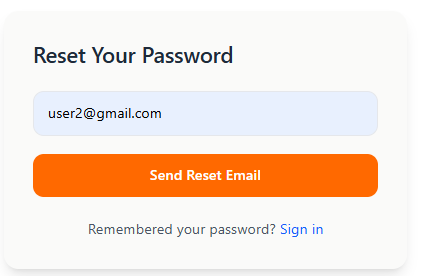
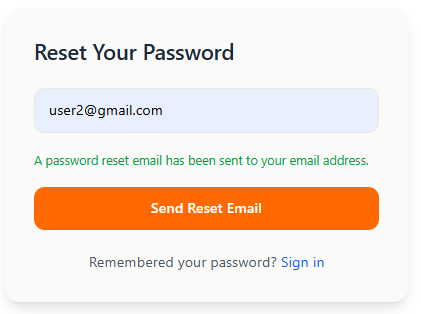
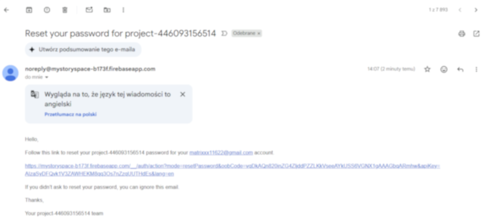
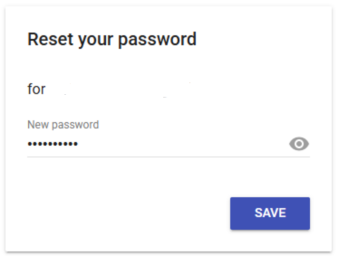
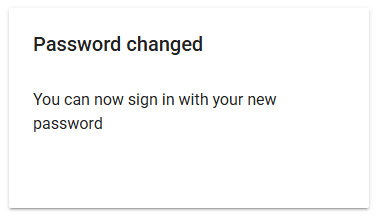

# Resetowanie hasła

1. Na stronie głównej kliknij **"Login"**.

<figure><figcaption></figcaption></figure>

2. Kliknij **"Forgot password?"**.
3. Wpisz swój adres e-mail i kliknij **"Send Reset Email"**.

<figure><figcaption></figcaption></figure>

4. Gdy pojawi się komunikat **"A password reset email has been sent to your email address."**, przejdź do swojej skrzynki pocztowej, otwórz wiadomość od nas i kliknij w link resetujący hasło.

<figure><figcaption></figcaption></figure>

<figure><figcaption></figcaption></figure>

5. Wpisz nowe hasło i kliknij **"SAVE"**.

<figure><figcaption></figcaption></figure>

6. Jeśli zobaczysz komunikat potwierdzający zmianę hasła, możesz teraz zalogować się nowym hasłem.

<figure><figcaption></figcaption></figure>
