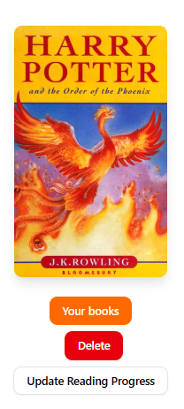
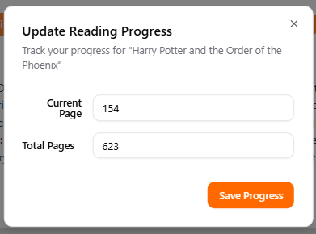
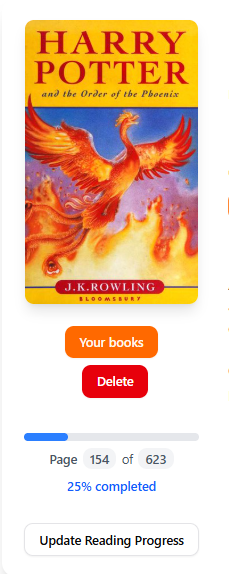

# Sledzenie postepu czytania

1. Wejdz na strone szczegółową ksiązki.
2. Gdy ksiązka jest na twojej półce "Reading" możesz dodać swój postęp w czytaniu klikająć "Update Reading Progress".

<figure><figcaption></figcaption></figure>

3. Wyświetli się okienko w którym możesz podać na której stronie w czytaniu obecnie jesteś oraz ile ksiązka ma całkowice stron i kliknąć "Save Progess".

<figure><figcaption></figcaption></figure>

4. Teraz możesz pobaczyć swój postęp. Aplikacja wyświetli ile stron przeczytałeś oraz pokaże procetowo ile już przeczytałeś.

<figure><figcaption></figcaption></figure>
