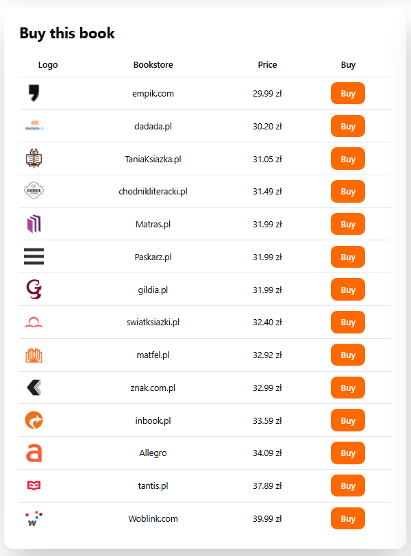
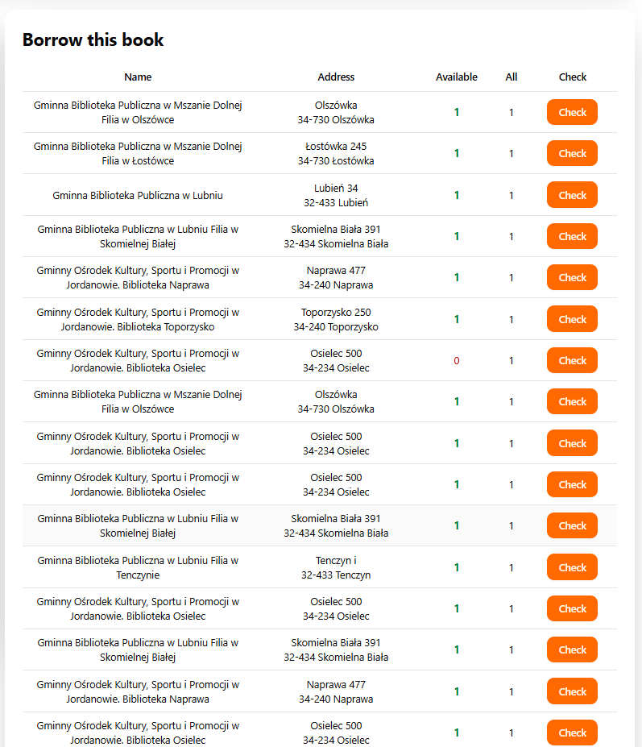

# Sprawdzanie dostępności książki w księgarniach i bibliotekach

1. Aby znaleźć tę sekcję, kliknij wybraną książkę, aby przejść do ekranu szczegółów.
2. Przewiń stronę w dół.

## Księgarnie

Sekcja **"Buy this book"** wyświetla aktualne oferty zakupu książki w internetowych księgarniach. Klikając **"Buy"**, przejdziesz do strony księgarni, gdzie możesz kupić wybrany tytuł. Widzisz nazwę księgarni, dostępność oraz cenę.

<figure><figcaption></figcaption></figure>

## Biblioteki

Sekcja **"Borrow this book"** pokazuje biblioteki w okolicy, w których możesz wypożyczyć książkę. Aby funkcja działała poprawnie, zezwól na dostęp do lokalizacji. W tabeli znajdziesz nazwę biblioteki, adres, liczbę dostępnych egzemplarzy oraz łączną liczbę posiadanych.

Klikając **"Check"**, przejdziesz do zewnętrznego serwisu z dodatkowymi informacjami i możliwością rezerwacji.

<figure><figcaption></figcaption></figure>
